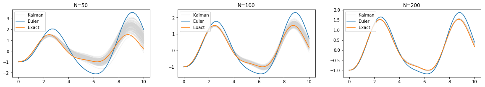
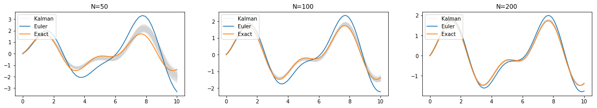

.. probDE documentation master file

*********************************************************
Probabilistic solution of ordinary differential equations
*********************************************************

.. toctree::
   :maxdepth: 2

Description
===========

**probDE** is a Python library that uses [probabilistic numerics](http://probabilistic-numerics.org/) to solve ordinary differential equations (ODEs). 
That is, most ODE solvers (such as [Euler's method](https://en.wikipedia.org/wiki/Euler_method)) produce a deterministic approximation to the ODE on a grid of size :math:`\delta`.  
As :math:`\delta` goes to zero, the approximation converges to the true ODE solution.  
Probabilistic solvers such as **probDE** also output a solution an a grid of size :math:`\delta`; however, the solution is random.  
Still, as :math:`\delta` goes to zero we get the correct answer.

**probDE** provides a probabilistic solver for univariate ordinary differential equations (ODEs) of the form

.. math::
    \begin{equation*}
    \boldsymbol{w'}\boldsymbol{x_t} = f(\boldsymbol{x_t}, t), \qquad \boldsymbol{x_L} = \boldsymbol{a},
    \end{equation*}

where :math:`\boldsymbol{x_t} = \big(x_t^{(0)}, x_t^{(1)}, ..., x_t^{(q)}\big)` consists of the first :math:`q` derivatives of the process :math:`x_t = x_t^{(0)}`, 
and a solution is sought on the interval :math:`t \in [L, U]`.  

**probDE** implements the probabilistic solver of [Chkrebtii et al (2016)](https://projecteuclid.org/euclid.ba/1473276259). 
This begins by putting a [Gaussian process](https://en.wikipedia.org/wiki/Gaussian_process) prior on the ODE solution, and updating it sequentially as the solver steps through the grid.

Walkthrough
===========

To illustrate, let's consider the following ODE example of order :math:`q = 2`:

.. math::
    \begin{equation*}
    x_t^{(2)} = \sin(2t) − x_t^{(0)}, \qquad \boldsymbol{x_0} = (-1, 0, 1),
    \end{equation*}

where the solution :math:`x_t` is sought on the interval :math:`t \in [0, 10]`.  In this case, the ODE has an analytic solution,

.. math::
    \begin{equation*}
    x_t = \frac{1}{3} \big(2\sin(t) - 3\cos(t) - \sin(2t)\big).
    \end{equation*}

To approximate the solution with the probabilistic solver, the Gaussian process prior we will use is a so-called 
[Continuous Autoregressive Process](https://CRAN.R-project.org/package=cts/vignettes/kf.pdf) of order $p$, 

.. math::
    \begin{equation*}
    \boldsymbol{X_t} \sim CAR_p(\boldsymbol{mu}, \boldsymbol{rho}, \sigma).
    \end{equation*}

Here $\boldsymbol{X_t} = \big(x_t^{(0)}, ..., x_t^{(p-1)}\big)$ consists of :math:`x_t` and its first :math:`p-1` derivatives. 
The :math:`CAR(p)` model specifies that each of these is continuous, but :math:`x_t^{(p)}` is not. 
Therefore, we need to pick :math:`p > q`. It's usually a good idea to have :math:`p` a bit larger than :math:`q`, 
especially when we think that the true solution :math:`x_t` is smooth. However, increasing :math:`p` also increases the computational burden, 
and doesn't necessarily have to be large for the solver to work.  For this example, we will use :math:`p=4`. The tuning parameters of the :math:`CAR(p)` prior are:

- The mean vector :math:`\boldsymbol{\mu}`.  By default we will set this to 0.
- The scale parameter :math:`\sigma`.
- The "roots" of the process :math:`\boldsymbol{\rho} = (\rho_0, \ldots, \rho_{p-1})`. These can be any distinct set of negative numbers. 
  We suggest parametrizing them as :math:`\rho_0 = -1/\tau` and :math:`\rho_k = -(1 + \tfrac{k}{10(p-1)})` for :math:`k > 0`, 
  in which case :math:`\tau` becomes a decorrelation-time parameter.

Finally, we need a way to initialize the remaining derivatives :math:`\boldsymbol{y_t} = \big(x_t^{(q+1)}, ..., x_t^{(p-1)}\big)` at time :math:`t = L`. 
Since the :math:`CAR(p)` process has a multivariate normal stationary distribtuion,
we suggest initializing :math:`\boldsymbol{y_L} \sim p(\boldsymbol{y_L} \mid \boldsymbol{x_L} = \boldsymbol{a})`,
i.e., as a random draw from this stationary distribution conditional on the value of :math:\boldsymbol{x_L} = \boldsymbol{a}`.
The Python code to implement all this is as follows.

.. code-block:: python

    from math import sin, cos
    import numpy as np
    import matplotlib.pyplot as plt # for plotting
    from probDE.utils.utils import root_gen
    from probDE.Kalman.kalman_solver import kalman_solver

.. code-block:: python

    # RHS of ODE
    def ode_fun(x_t, t):
        return sin(2*t) - x_t[0]

    # LHS vector of ODE
    w_vec = np.array([0.0, 0.0, 1.0])

    # These parameters define the order of the ODE and the CAR(p) process
    q = 2 # ODE order
    p = q+2 # number of continuous derivatives of CAR(p) solution prior

    # it is assumed that the solution is sought on the interval [L,U].
    N = 100 # Number of grids points that are evaluated; in particular, the grid size delta = (U-L)*1/N
    L = 0
    U = 10 

    # Now we need the parameters for the solver
    # First we need to generate roots, rho, for the CAR(p) prior
    # We suggest using root_gen to parametrize them as desribed: rho_k = -exp(k/tau)
    tau = 50 # decorrelation parameter
    roots = root_gen(tau, p)

    # The rest of the parameters can be tuned according to ODE
    # For this problem, we will use
    mu = np.zeros(p)
    sigma = .5

    # Initial value, x0, for the IVP
    a = np.array([-1.0, 0.0, 1.0])

    # Run the solver to get an approximation
    Xn, Xn_mean, Xn_var = kalman_solver(ode_fun, L, U, N, mu, sigma, roots, w_vec, a)

We drew 100 samples from the solver to compare them to the exact solution and the Euler approximation to the problem. 

For :math:`x^{(0)}_t`:

For :math:`x^{(1)}_t`:

Installation
============

You can get the very latest code by getting it from GitHub and then performing
the installation.

.. code-block:: bash

    git clone https://github.com/mlysy/probDE.git
    cd filterpy
    python setup.py install

Functions Documentation
=======================

Documentation for Generalized Bayesian Solver
---------------------------------------------
.. toctree::
   :caption: Generalized Bayesian Solver
   :maxdepth: 1

   Bayesian/Bayesian_ODE
   Bayesian/Covariance_Priors

Documentation for Kalman Solver
-------------------------------
.. toctree::
   :caption: Kalman Solver
   :maxdepth: 1

   Kalman/Kalman_ODE_Higher
   Kalman/KalmanTV
