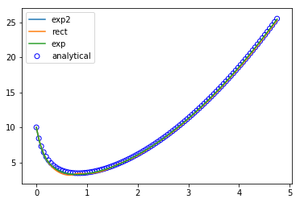

.. probDE documentation master file

Bayesian Solver for Univariate ODEs
===================================

.. toctree::
   :maxdepth: 2

probDE is a Python library that implements a couple of ODE solvers including
Bayesian methods and Kalman methods. The main focus of this library is using
Kalman Filter and Kalman Smoother to solve higher ordered ODE problems. 

This is accomplished by starting with an initial value. Then at each time 
point, the mean and variance is updated using Kalman Filter so that a new 
observation can be interrogated. After interrogating all the required
observations, they are smoothed over with Kalman Smoother.  

Installation
============

You can get the very latest code by getting it from GitHub and then performing
the installation.

.. code-block:: bash

    $ git clone https://github.com/mlysy/probDE.git
    $ cd filterpy
    $ python setup.py install

Usage
=====

Kalman
------

As a simple example, consider the second order initial value ODE problem,

.. math::
    \begin{align*}
    x^{(2)}(t) &= sin(2t) − x, \quad t ∈ [0, 10], \\
    x^{(1)}(0) &= 0, \quad x(0) = −1. 
    \end{align*}

Its exact solution is :math:`x^{\star}(t) = \frac{−3 cos(t) + 2 sin(t) − sin(2t)}{3}`.

The exact solution can be coded in python as follow:

.. code-block:: Python

    from math import sin, cos
    def chk_F(y_t, t):
        return sin(2*t) - y_t[0] #X^{2} = sing(2t) - X

    def chk_exact_x(t):
        return (-3*cos(t) + 2*sin(t) - sin(2*t))/3

    def chk_exact_x1(t):
        return (-2*cos(2*t) + 3*sin(t) + 2*cos(t))/3

Now given the initial value, one way to apply the algorithm to find the ode solution
is to use CAR(p) process. Let q be the number of times the derivative is defined for
in the problem. In our example above, it would be :math:`q=2`. Now we need to find
the initial observation from the CAR(p) process as follows:

.. code-block:: Python
    
    import numpy as np
    from BayesODE.Tests.root_gen import root_gen
    from BayesODE.Kalman.kalman_initial_draw import kalman_initial_draw
    N = 100
    q = 2
    p = q+2

    delta_t = np.array([1/N])
    r0 = 0.5
    sigma = 0.001
    roots = root_gen(r0, p) #Generate roots to draw x^{(3)}_0
    a = np.array([0,0,1])
    x0 = np.array([-1,0,0])
    x0 = np.array([-1,0,chk_F(x0, 0)]) #Initial state
    x_0 = kalman_initial_draw(roots, sigma, x0, p)

Next, we need to compute the transition matrix and variance matrix defining the
solution prior. If we assume the prior is :math:`CAR_p(0, \rho, \sigma)` where 
:math:`\rho =roots` then we can compute them as follows:

.. code-block:: Python

   wgtState, varState = higher_mvCond(delta_t, roots, sigma) 
   muState = np.zeros(p)

Finally, to run the solver:

.. code-block:: Python

   Yn, Yn_chk_mean, Yn_chk_var = kalman_ode_higher(chk_F, x_0, N-1, wgtState, muState, varState, a)

We drew 100 samples from the solver to compare them to the exact solution and the Euler approximation to the problem. 

For :math:`x^{(0)}`:

.. image:: Kalman/chkrebtii_x0.png

For :math:`x^{(1)}`:

Bayesian
--------

For the Bayesian method, we use this simple example:

.. code-block:: Python

    def f(x,t):
        return  3*(t+1/4) - x/(t+1/4)

The initial values of the problem and the grid size can be defined as follows:

.. code-block:: Python

    a = 0
    b = 4.75
    x0_f1 = 10
    N = 100
    tseq1 = np.linspace(a, b, N)

The two parameters :math:`\alpha` and :math:`\gamma` can be tuned. The Tuning jupyter notebook
shows an example of how to tune these parameters based on the kernel. For this example, we can use:

.. code-block:: Python

    gamma = 1.67
    alpha = 1000

Now, all we need to do is choose the kernel we want and get the initial :math:`\Sigma` matrix. For 
example, we can use the square exponential kernel:

.. code-block:: Python

    import BayesODE.Bayesian as bo
    Sigma_vv = bo.cov_vv_se(tseq1, tseq1, gamma, alpha)
    Sigma_xx = bo.cov_xx_se(tseq1, tseq1, gamma, alpha)
    Sigma_xv = bo.cov_xv_se(tseq1, tseq1, gamma, alpha)

Finally, we run the solver to get an approximate solution, the mean and the variance of the approximation:

.. code-block:: Python

    xt1,mu_x,var_x = bo.bayes_ode(f, tseq1, x0_f1, Sigma_vv, Sigma_xx, Sigma_xv)

We can look at the results of all three kernels compared to the exact solution.

Functions Documentation
=======================

Documentation for Bayesian
--------------------------
.. toctree::
   :maxdepth: 1

   Bayesian/Exponential_Kernel
   Bayesian/Rectangular_Kernel
   Bayesian/SquareExponential_Kernel
   Bayesian/Bayesian_ODE

Documentation for Kalman
------------------------
.. toctree::
   :maxdepth: 1

   Kalman/KalmanTV
   Kalman/Kalman_ODE_Higher
   Kalman/Kalman_ODE

Indices and tables
==================

* :ref:`genindex`
* :ref:`modindex`
* :ref:`search`
