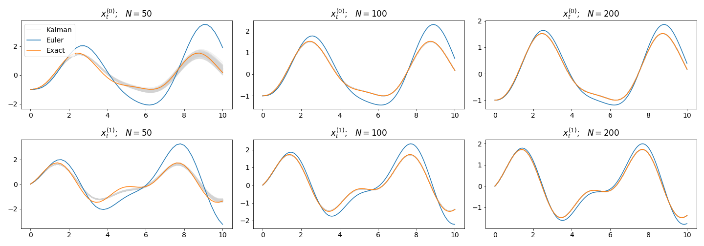
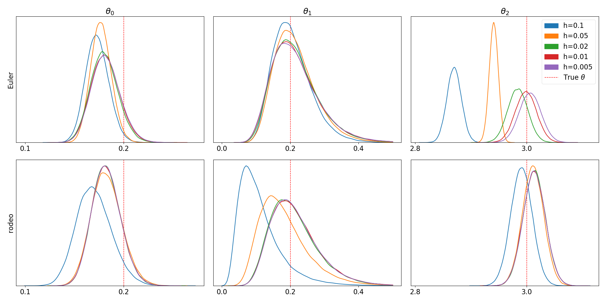

.. rodeo documentation master file

************************
pRobabilistic ODE sOlver
************************

.. toctree::
   :maxdepth: 2

Description
===========

**rodeo** is a Python library that uses `probabilistic numerics <http://probabilistic-numerics.org/>`_ to solve ordinary differential equations (ODEs). 
That is, most ODE solvers (such as `Euler's method <https://en.wikipedia.org/wiki/Euler_method>`_) produce a deterministic approximation to the ODE on a grid of size :math:`\delta`.  
As :math:`\delta` goes to zero, the approximation converges to the true ODE solution.  
Probabilistic solvers such as **rodeo** also output a solution an a grid of size :math:`\delta`; however, the solution is random.  
Still, as :math:`\delta` goes to zero we get the correct answer.

**rodeo** provides a probabilistic solver for univariate ordinary differential equations (ODEs) of the form

.. math::
    \begin{equation*}
    \boldsymbol{W}\boldsymbol{x(t)} = f(\boldsymbol{x(t)}, t), \qquad t\in [0, T], \qquad \boldsymbol{x(0)} = \boldsymbol{v},
    \end{equation*}

where :math:`\boldsymbol{x}_t = \big(x(t)^{(0)}, x(t)^{(1)}, ..., x(t)^{(q)}\big)` consists of :math:`x(t)` and its first :math:`q` derivatives,
:math:`\boldsymbol{W}` is a coefficient matrix, and :math:`f(\boldsymbol{x(t)}, t)` is typically a nonlinear function.

**rodeo** implements the probabilistic solver of `Chkrebtii et al (2016) <https://projecteuclid.org/euclid.ba/1473276259>`_. 
This begins by putting a `Gaussian process <https://en.wikipedia.org/wiki/Gaussian_process>`_ prior on the ODE solution, and 
updating it sequentially as the solver steps through the grid. Various low-level backends are provided in the following modules:

- `rodeo.cython`: This module performs the underlying linear algebra using the BLAS/LAPACK routines provided by NumPy through a Cython interface.  
  To maximize speed, no input checks are provided.  All inputs must be `float64` NumPy arrays in *Fortran* order. 

- `rodeo.eigen`: This module uses the C++ Eigen library for linear algebra.  The interface is also through Cython.  
  Here again we have the same input requirements and lack of checks.  Eigen is known to be faster than most BLAS/LAPACK implementations, 
  but it needs to be compiled properly to achieve maximum performance.  In particular this involves linking against an installed version of Eigen (not provided)
  and setting the right compiler flags for SIMD and OpenMP support.  Some defaults are provided in `setup.py`, but tweaks may be required depending on the user's system. 

- `rodeo.numba`: This module once again uses BLAS/LAPACK but the interface is through Numba.  Here input checks are performed and the inputs can be 
  in either C or Fortran order, and single or double precision (`float32` and `float64`).  However, C ordered arrays are first converted to Fortran order, 
  so the latter is preferable for performance considerations.

Installation
============

You can get the very latest code by getting it from GitHub and then performing
the installation.

.. code-block:: bash

    git clone https://github.com/mlysy/rodeo.git
    cd rodeo
    pip install .

Unit Testing
============

The unit tests are done against the deterministic ode solver **odeint** to ensure that the solutions are approximately equal.

.. code-block:: bash

    cd tests
    python -m unittest discover -v

Examples
========

We provide four separate ODE problems as examples to demonstrate the capabilities of **rodeo**. These examples are best viewed in the `examples/tutorial.ipynb` jupyter notebook, hence extra installations are required.

.. code-block:: bash

    pip install .[examples]

Walkthrough
===========
Univariate ODE
--------------
To illustrate, let's consider the following ODE example of order :math:`q = 2`:

.. math::
    \begin{equation*}
    x_t^{(2)} = \sin(2t) − x_t^{(0)}, \qquad \boldsymbol{x_0} = (-1, 0, 1),
    \end{equation*}

where the solution :math:`x_t` is sought on the interval :math:`t \in [0, 10]`.  In this case, the ODE has an analytic solution,

.. math::
    \begin{equation*}
    x_t = \frac{1}{3} \big(2\sin(t) - 3\cos(t) - \sin(2t)\big).
    \end{equation*}

To approximate the solution with the probabilistic solver, the Gaussian process prior we will use is a so-called 
[Continuous Autoregressive Process](https://CRAN.R-project.org/package=cts/vignettes/kf.pdf) of order :math:`p`. 
A particularly simple :math:`\mathrm{CAR}(p)` proposed by [Schober](http://link.springer.com/10.1007/s11222-017-9798-7) is the 
:math:`p-1` times integrated Brownian motion, 

.. math::

    \begin{equation*}
    \boldsymbol{x(t)} \sim \mathrm{IBM}(p).
    \end{equation*}

Here :math:`\boldsymbol{x(t)} = \big(x(t)^{(0)}, ..., x(t)^{(p-1)}\big)` consists of :math:`x(t)` and its first :math:`p-1` derivatives. 
The :math:`\mathrm{IBM}(p)` model specifies that each of these is continuous, but :math:`x^{(p)}(t)` is not. 
Therefore, we need to pick :math:`p > q`. It's usually a good idea to have :math:`p` a bit larger than :math:`q`, especially when 
we think that the true solution :math:`x(t)` is smooth. However, increasing :math:`p` also increases the computational burden, 
and doesn't necessarily have to be large for the solver to work.  For this example, we will use :math:`p=4`. 
To initialize, we simply set :math:`\boldsymbol{x(0)} = (\boldsymbol{x}_0, 0)`. The Python code to implement all this is as follows.

.. code-block:: python

    import numpy as np
    import matplotlib.pyplot as plt
    from scipy.integrate import odeint

    from rodeo.ibm import ibm_init
    from rodeo.cython.KalmanODE import KalmanODE
    from rodeo.utils import indep_init, zero_pad

.. code-block:: python

    # RHS of ODE
    from math import sin, cos
    def ode_fun(x, t, theta=None, x_out=None):
        if x_out is None:
            x_out = np.zeros(1)
        x_out[0] = sin(2*t) - x[0]
        return

    W = np.array([[0.0, 0.0, 1.0]])  # LHS vector of ODE
    x0 = np.array([-1., 0., 1.])  # initial value for the IVP

    # Time interval on which a solution is sought.
    tmin = 0
    tmax = 10
        
    # These parameters define the order of the ODE and the CAR(p) process
    n_deriv = [2]
    n_deriv_prior = [4]

    # zero padding
    W_pad = zero_pad(W, n_deriv, n_deriv_prior)
    x0_pad = zero_pad(x0, n_deriv, n_deriv_prior)

    # IBM process scale factor
    sigma = [.5]

    n_points = 80  # number of steps in which to discretize the time interval.
    dt = (tmax-tmin)/n_points  # step size

    # generate the Kalman parameters corresponding to the prior
    prior = ibm_init(dt, n_deriv_prior, sigma)

    # instantiate the ODE solver
    kalmanode = KalmanODE(W_pad, tmin, tmax, n_points, ode_fun, **prior)

    # probabilistic output: draw from posterior
    kalman_sim = kalmanode.solve_sim(x0_pad)

We drew 100 samples from the solver to compare them to the exact solution and the Euler approximation to the problem. 

Statistical inference
---------------------

**rodeo** is also capable of performing parameter inference. To demonstrate we will use the famous **FitzHugh-Nagumo** 
model which consists of a two-state nonlinear ODE where one state describes the evolution of the neuronal membrane voltage, 
and the other describes the activation and deactivation of neuronal channels. Precisely, the ODE can be stated as,

.. math::
    \begin{equation}
	\begin{aligned}
		V(t)^{(1)} &= c(V(t)^{(0)} - \frac{(V(t)^{(0)})^3}{3} + R(t)^{(0)}), \\
		R(t)^{(1)} &= -\frac{V(t)^{(0)} - a + bR(t)^{(0)}}{c}, \\
		V(0)^{(0)} &= -1, \qquad R(0)^{(0)} = 1, \qquad t \in [0, 40].
	\end{aligned}
    \end{equation}

Suppose, we use :math:`\theta = (a,b,c) = (.2,.2,3)` as the true parameters then the initial value is :math:`(V(0)^{(1)}, R(0)^{(1)}) = (1, 1/3)`. 
Here we set :math:`\boldsymbol{x}(0) = (-1, 1, V(0)^{(2)}, 1, 1/3, R(0)^{(2)})` for our solver, where :math:`V(0)^{(2)} = R(0)^{(2)} = 0`. 
We attempt to infer :math:`\theta` from the observations of both states at times :math:`t=1,2,\ldots,40`. 
The priors are log-normal with the true value as the mean and unit variance. The observations are generated using the equation,

.. math::
    \begin{equation}
    \begin{aligned}
        Y_t = X_t + \gamma \epsilon_t, \quad \epsilon_t \stackrel{iid}{\sim} \mathcal N(0, 1)
    \end{aligned}
    \end{equation}
 
where :math:`X_t` are computed from `odeint` and :math:`\gamma=0.2` is the noise standard deviation. We have written an useful module, 
`inference`, to perform inference on the parameters and plot the distribution of sampled parameters. 
A comparison of the deterministic Euler solver to the probabilistic solver is shown below.

Functions Documentation
=======================
.. toctree::
   :maxdepth: 1

   ./KalmanODE
   ./utils
   ./car